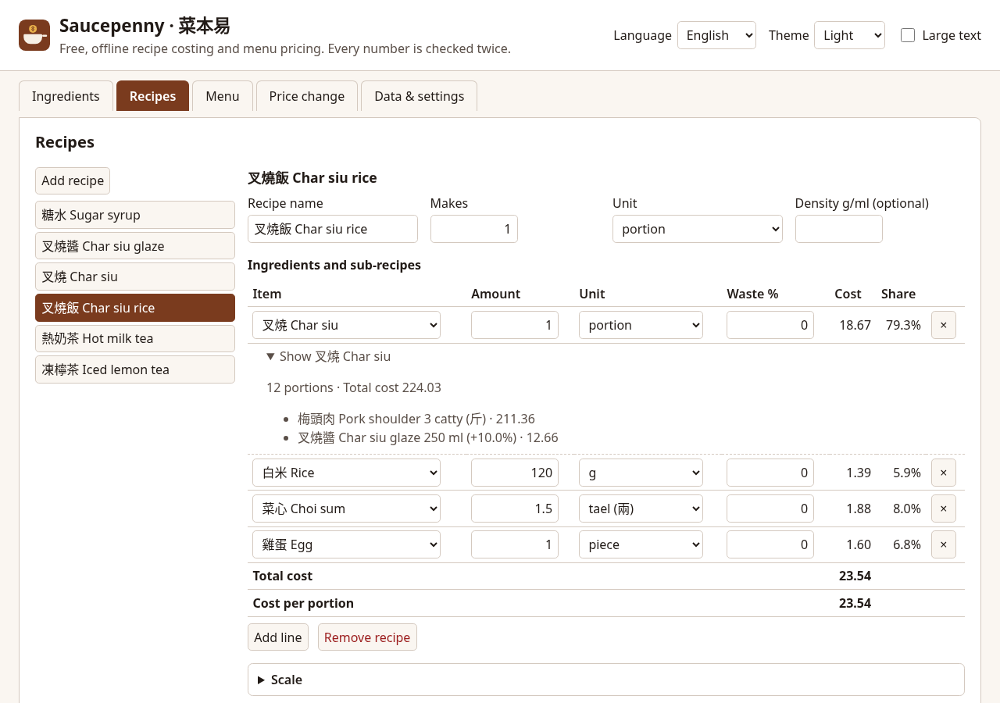

# Saucepenny · 菜本易

**English** · [繁體中文](#繁體中文)

Saucepenny is a free, open-source, offline **recipe costing and menu pricing** tool for
small restaurants, cha chaan tengs, cafés, home bakers, private kitchens, social
enterprises, NGO kitchens and cookery classes. Enter what you pay for ingredients, how
much of each is usable after trimming, and your recipes (recipes can contain other
recipes, such as a sauce or a syrup). Saucepenny works out the cost of every recipe, the
**cost per portion**, the **food cost %** of every menu item and a **suggested price**.

- **Exact arithmetic.** Every amount is an exact fraction internally; nothing is rounded
  until it is shown. An **independent checker** recomputes every number a different way,
  and the two must agree exactly.
- Hong Kong units (斤, 兩) and HK$, plus g/kg, oz/lb, ml/L and US cups and spoons. All
  unit constants are cited from the law or from NIST ([docs/units.md](docs/units.md)).
- 10% service charge handled explicitly.
- No account, no server, no telemetry, no subscription. Your supplier prices stay in your
  browser.
- English and Traditional Chinese.
- Licence: [AGPL-3.0-or-later](LICENSE).



### New in v0.3

- **Menu engineering**: type or import (CSV) how many of each dish you sold, and see each
  item's margin, share of sales and group — Keep, Raise margin, Promote or Rethink —
  using written, checked rules (rule 16). Sales counts stay in your browser and are not
  saved in the project.
- **Supplier price lists**: import a supplier's CSV, match each row to your ingredients
  (matches are remembered on this device), review the change per unit, then apply. Old
  prices go into the price history (rule 17).

### New in v0.2

- **Fractions** in quantities: `1/2`, `1 1/2`, `½`, `1½` (kept exactly as typed).
- **Duplicate recipe** to make a variation in one click.
- **Custom measures** (scoop, bowl, cup…) can be added, renamed and removed in the Data
  tab; a measure in use cannot be removed.
- **Labour and overhead** per batch (minutes × hourly rate, fixed amount, % of food
  cost), shown as a **full cost**. The food cost % on the menu is unchanged.
- **Price history**: old prices are kept when you change one, the change % is shown, and
  the price change tool can start from any old price.
- **"Pinch" lines** (少量): a line can count 0–100% of its cost; 0% needs no conversion.
  Reports mark these lines.
- **Recipe weight**: total ingredient weight per batch and per portion.
- **Keep data safe**: Saucepenny asks the browser to keep its storage (and shows whether
  it agreed), and reminds you to save a backup file after many changes or two weeks.
  The reminder never uses the network and can be dismissed.

### Use it

- **In the browser:** <https://kinfxhk.github.io/saucepenny/> — nothing to install, and
  it works offline after the first visit. Your data stays in your browser.
- **Download:** a static site zip (with SHA-256) is attached to each
  [release](https://github.com/Kinfxhk/saucepenny/releases).
- **On your own computer** (Node.js 22+):

```sh
npm ci
npm start   # http://127.0.0.1:4893/
```

- **Docker** (serves only the static site, on your own machine):

```sh
docker build -t saucepenny .
docker run --rm -p 127.0.0.1:4893:4893 saucepenny
```

- **Command line** (same engine, same verified numbers):

```sh
npm run saucepenny -- cost examples/cha-chaan-teng.json
npm run saucepenny -- impact examples/cha-chaan-teng.json sugar 15
```

- **Guide:** [docs/guide.md](docs/guide.md) · calculation rules:
  [docs/calculation-rules.md](docs/calculation-rules.md) · units and their legal sources:
  [docs/units.md](docs/units.md).
- **Examples** (all invented): [examples/](examples/) — a cha chaan teng (叉燒飯 with
  叉燒 → 叉燒醬 → 糖水, milk tea), a home bakery (cookie gift boxes, cheesecake by the slice
  or whole) and a social-enterprise lunch box with a senior concession price.

### Important

- **Estimates only, not accounting or tax advice.** Results depend entirely on the
  prices, yields and quantities you enter.
- Saucepenny does not calculate nutrition or allergens.
- Saucepenny is an independent project and is **not affiliated** with, endorsed by or
  sponsored by any other recipe-costing product or company.

## Contributing

Contributions are welcome under the rules in [CONTRIBUTING.md](CONTRIBUTING.md):
clean-room work only, every displayed number must be confirmed by the independent
checker, and commits are signed off (DCO). Everyone taking part follows the
[Code of Conduct](CODE_OF_CONDUCT.md).

**How it is made:** Saucepenny is written with AI coding agents working under the
maintainer's direction. That is why the project leans so hard on machine checking: an
independent checker must agree exactly with the costing engine, and golden, property and
mutation tests, a licence allowlist, a hygiene check and a secret scan run on every
change. Contributors may use AI tools too, under the
[AI-assisted development policy](CONTRIBUTING.md#ai-assisted-development).

## Commitments

Saucepenny will **never** have:

- **ads**;
- **tracking or analytics** of any kind, not even "anonymous";
- **paid unlocks**, subscriptions, per-outlet fees, usage limits or accounts.

The code stays open source under AGPL-3.0-or-later, so nobody can turn it into a closed
paid service without sharing their changes. Donations are optional and change nothing in
the app.

Source code: <https://github.com/Kinfxhk/saucepenny>

If Saucepenny helps you, you can support it at
[Buy Me a Coffee](https://buymeacoffee.com/kinfxhk).

---

## 繁體中文

菜本易（Saucepenny）是免費、開源、可離線使用的**食譜成本及餐牌定價**工具，適合小型
食肆、茶餐廳、咖啡店、家庭烘焙、私房菜、社企、非政府機構廚房及烹飪課。輸入食材買入價、
處理後的可用率及食譜（食譜可包含其他食譜，例如醬汁或糖水），菜本易即計出每個食譜的
成本、**每份成本**、每個餐牌項目的 **food cost %** 及**建議售價**。

- **精確計算：**內部所有數值都是精確分數，只在顯示時才四捨五入；另有**獨立檢查器**以
  另一種方法重算每個數字，兩者必須完全相同。
- 支援港式單位（斤、兩）及港幣，亦支援克、公斤、安士、磅、毫升、公升及美制杯、匙；所有
  單位常數均引用法例或 NIST 原文（[docs/units.md](docs/units.md)）。
- 清楚處理一成服務費。
- 無需帳戶、無伺服器、無遙測、無月費；供應商價錢只存於你的瀏覽器。
- 提供英文及繁體中文介面。
- 授權：[AGPL-3.0-or-later](LICENSE)。


### v0.3 新功能

- **餐牌分析**：輸入或匯入（CSV）每款菜式售出多少份，即可看到每項的毛利、銷售佔比及分類——
  主力、提高毛利、多推廣或檢討——全按公開及經核對的規則（規則 16）。銷售份數只留在瀏覽器，
  不會存入項目。
- **供應商價目表**：匯入供應商的 CSV，把每行配對到你的食材（配對會記在這部裝置），檢查每單位
  的價錢變動後才套用；舊價錢會保留在價格紀錄（規則 17）。

### v0.2 新功能

- 用量可輸入**分數**：`1/2`、`1 1/2`、`½`、`1½`（按輸入原樣精確保存）。
- **複製食譜**，一按即可做變化版本。
- 在「資料」頁新增、改名及刪除**自訂量度**（羹、殼、碗等）；使用中的量度不能刪除。
- 每批**人工及雜費**（分鐘 × 每小時成本、固定金額、食材成本的百分比），顯示**全部成本**；
  餐牌上的 food cost % 不變。
- **價錢紀錄**：改價時保留舊價錢並顯示變幅；加價影響工具可從任何舊價錢開始試算。
- **「少量」行**：每行可只計 0–100% 成本；0% 毋須換算單位，報表會註明。
- **食譜重量**：每批及每份的材料總重。
- **保護資料**：菜本易會向瀏覽器申請保留儲存（並顯示結果），在多次修改或兩星期後提醒你
  儲存備份檔；提醒不經網絡，可以關閉。

### 使用方法

- **瀏覽器：**<https://kinfxhk.github.io/saucepenny/>，無需安裝，首次瀏覽後可離線使用，資料只存於你的瀏覽器。
- **下載：**每個 [release](https://github.com/Kinfxhk/saucepenny/releases) 都附有靜態網站 zip 及 SHA-256。
- **在自己電腦執行**（Node.js 22 或以上）、Docker 及命令列：見上方英文部分的指令。
- **使用說明：**[docs/guide.zh-Hant.md](docs/guide.zh-Hant.md)；計算規則：
  [docs/calculation-rules.md](docs/calculation-rules.md)；單位及法例出處：[docs/units.md](docs/units.md)。
- **範例**（全屬虛構）：[examples/](examples/)：茶餐廳（叉燒飯 → 叉燒 → 叉燒醬 → 糖水、奶茶）、
  家庭烘焙（曲奇禮盒、芝士蛋糕按件或原個）、社企午餐飯盒（設長者優惠價）。

### 重要事項

- **只供估算，並非會計或稅務意見。**結果完全取決於你輸入的價錢、可用率及用量。
- 菜本易不計算營養或致敏原。
- 菜本易是獨立項目，與任何其他食譜成本產品或公司**並無關連**，亦未獲其認可或贊助。

### 承諾

菜本易**永遠不會**有廣告、任何形式的追蹤或分析、付費解鎖、訂閱、按分店收費、用量限制或帳戶。
程式碼以 AGPL-3.0-or-later 開源；捐款純屬自願，不會改變程式任何功能。

### 開發方式及參與

菜本易由 AI 編程助手在維護者指示下撰寫。正因如此，項目非常依賴機器檢查：獨立檢查器必須與成本引擎
結果完全相同，每次修改都要通過標準答案測試、性質測試、變異測試、授權白名單、項目規範檢查及密鑰掃描。
歡迎貢獻，但須遵守 [CONTRIBUTING.md](CONTRIBUTING.md)（只可自行撰寫；如使用 AI 工具須逐行審閱、
負 DCO 責任並在 pull request 註明）及[行為守則](CODE_OF_CONDUCT.md)。

- 原始碼：<https://github.com/Kinfxhk/saucepenny>
- 支持項目：<https://buymeacoffee.com/kinfxhk>
